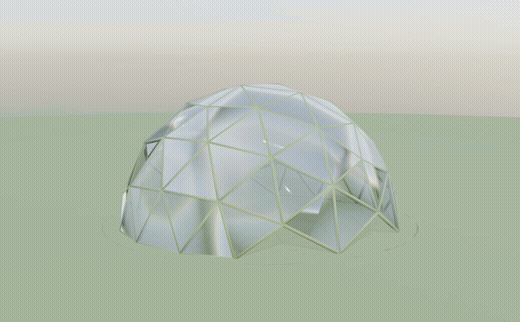
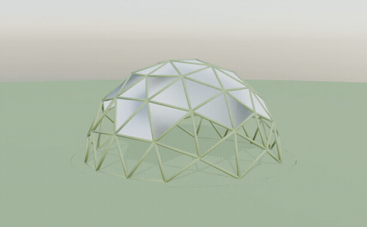

# 竹ドーム シミュレーション 操作マニュアル

Blenderで `output/sim/*.blend` を開いて、雪積もり・ビニール被覆・MPM雪のアニメを再生・操作する方法。

---

## 1. 開き方

```bash
# macOS
open -a Blender output/sim/snow_color.blend
open -a Blender output/sim/vinyl2.blend
open -a Blender output/sim/mpm_snow_anim.blend
```

または Blender を起動して「ファイル → 開く」で `.blend` を選択。

---

## 2. 動かし方（共通）

### 視点操作
| キー/操作 | 機能 |
|---|---|
| **マウス中ボタンドラッグ** | 視点回転 |
| **Shift + 中ドラッグ** | 視点平行移動 |
| **スクロール** | ズーム |
| **テンキー 1 / 3 / 7** | 正面 / 側面 / 上面ビュー |
| **テンキー 0** | カメラ視点 |

### ビューポート表示モード（**色を出すのに必須**）
画面右上の球アイコン or `Z` キー：
- **ソリッド**（既定、色なし・グレー）
- **マテリアルプレビュー**（色が出る、推奨）
- **レンダー**（最高品質、サブサーフェスやガラスも見える）

### アニメ再生
| キー | 機能 |
|---|---|
| **スペースキー** | 再生/停止 |
| **←/→** | 1フレーム前後 |
| **Shift + ←/→** | 最初/最後へ |
| **タイムライン上をドラッグ** | 任意フレームへスクラブ |

### レンダリング（高品質画像保存）
- **F12** … カメラからレンダリング（PNG出力）
- **Ctrl + F12** … アニメ全フレームをレンダリング

---

## 3. 各 .blend の見どころ

### `bvs2.blend`（竹ビニールドーム雪積もり, **おすすめ**）
- 150フレーム。緑の草原に立つ竹ビニールドーム（竹格子＋半透明ビニール被覆）
- 空に雪粒子が舞い、地面が雪原に変化、ドームに雪冠が成長
- 後半でドームが**雪の重みで潰れる**演出（Z方向に圧縮）



### `snow_color.blend`（雪積もりアニメ・ビニールなし）
- 120フレーム。緑の草原 → 雪が徐々に積もる → 1mの雪景色
- 開いた瞬間からマテリアル表示で色が出る
- **物理モデル**：屋根形状係数 μ_b=√cos(1.5β) で急斜面は滑落、クラウンに堆積、風で吹きだまり（融雪なし）



### `vinyl2.blend`（ビニール被覆クロスシミュレーション）
- 100フレーム。空中のビニールシートが落下してドームに被さる
- 半透明ビニール（Transmission 0.5）で竹格子が透けて見える
- Blenderの Cloth モディファイアで物理シミュレーション

### `mpm_snow_anim.blend`（MPM粘着雪、120フレーム）
- Disney『アナ雪』の雪物理（Stomakhin et al. 2013, MLS-MPM）
- 雪が凝着・パッキング・焼結する弾塑性連続体モデル
- frame 71 でクラウン積雪 426cm に到達 → 構造利用率1.0で**崩壊検出**

---

## 4. 再生成（変更したい時）

```bash
# 竹ビニールドーム雪積もり（おすすめ・潰れる演出付き）
/Applications/Blender.app/Contents/MacOS/Blender --background --factory-startup \
  --python blender/bamboo_vinyl_snow.py -- \
  --geo output/sim/dome_snow_scene.json \
  --out output/sim/bvs_ --blend output/sim/bvs.blend \
  --snow-m 1.2 --animate 150 --hours 14 --res 1280 \
  --falling 5000 --collapse-defl 0.25

# 雪積もりアニメ（ビニール無し版・フレーム数・積雪量を変える）
/Applications/Blender.app/Contents/MacOS/Blender --background --factory-startup \
  --python blender/snow_scene.py -- \
  --geo output/sim/dome_snow_scene.json \
  --out output/sim/snow_v_ --blend output/sim/snow_v.blend \
  --animate 180 --snow-m 1.5 --hours 14 --res 1280

# ビニール被覆
/Applications/Blender.app/Contents/MacOS/Blender --background --factory-startup \
  --python blender/vinyl_cover.py -- \
  --geo output/sim/dome_snow_scene.json \
  --out output/sim/vinyl.png --blend output/sim/vinyl.blend --frames 100

# MPM粘着雪
.venv-mpm/bin/python tools/bake_mpm.py \
  --frames 150 --particles 130000 --substeps 100 --snow-scale 14 \
  --out output/sim/mpm
/Applications/Blender.app/Contents/MacOS/Blender --background --factory-startup \
  --python blender/render_mpm.py -- \
  --geo output/sim/dome_snow_scene.json --ply-dir output/sim/mpm \
  --out output/sim/mpm.mp4 --blend output/sim/mpm.blend --animate
```

---

## 5. トラブルシューティング

| 症状 | 原因 / 対策 |
|---|---|
| **色が出ない（グレー）** | ビューポートが「ソリッド」表示。`Z` → マテリアルプレビュー or 右上の球アイコン |
| **動画が `open` で開かない** | 既定アプリ起動エラー。`open -a "QuickTime Player" 動画.mp4` で明示指定 |
| **mp4 がカクつく/再生不可** | コーデック非互換。`ffmpeg -i in.mp4 -c:v libx264 -pix_fmt yuv420p out.mp4` で再エンコード |
| **アニメ再生で何も動かない** | フレーム範囲が1のみ。タイムライン下部の `Start/End` を確認 |
| **Blenderが固まる** | 大きい `.blend`（100MB+）は読み込みに時間。Activity Monitorで確認 |
